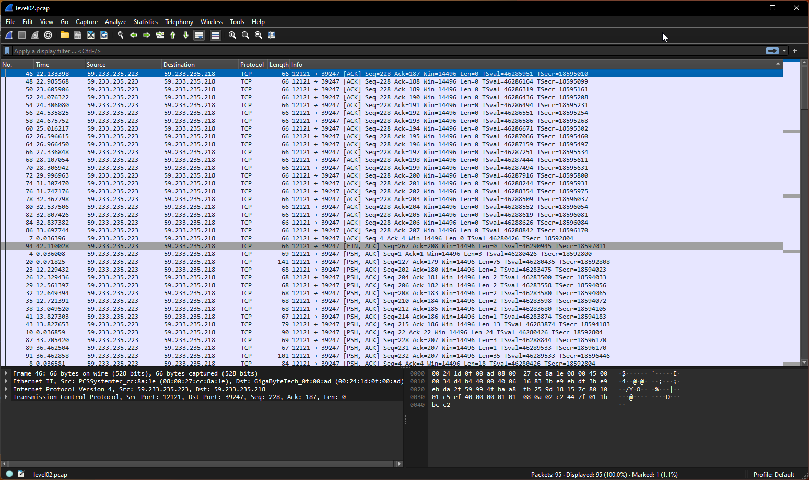
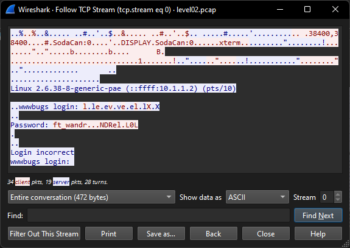
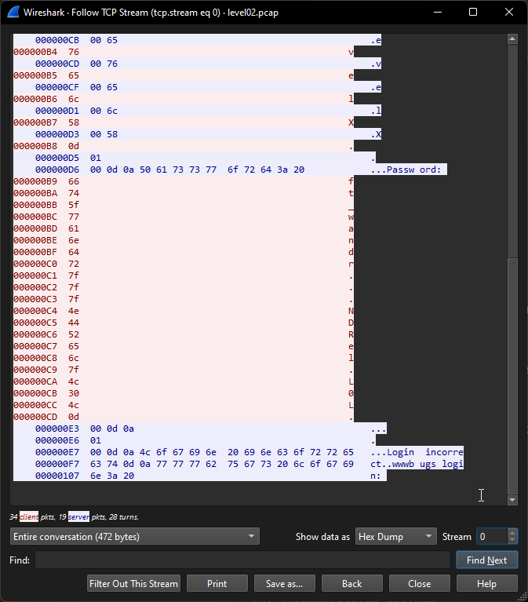

Je streamline ma procédure d'identification : 

```
$ id && pwd && ls -la
uid=2002(level02) gid=2002(level02) groups=2002(level02),100(users)
/home/user/level02
total 24
dr-x------ 1 level02 level02  120 Mar  5  2016 .
d--x--x--x 1 root    users    340 Aug 30  2015 ..
-r-x------ 1 level02 level02  220 Apr  3  2012 .bash_logout
-r-x------ 1 level02 level02 3518 Aug 30  2015 .bashrc
----r--r-- 1 flag02  level02 8302 Aug 30  2015 level02.pcap
-r-x------ 1 level02 level02  675 Apr  3  2012 .profile
```

Ok, j'observe un fichier `.pcap`. Je tente un cat :

```
$ cat level02.pcap
�ò�@f&N.J'̊$E<��@@J>;���;��ߙO/Y������
 @f&N�JJ$'E<@@�/;���;���/Y�O���A� 8����
�.� @f&N�B'̊$E4��@@JE;���;��ߙO/Y�º��B�sp
...
```

Je me renseigne sur cette extension.

D'après [Comparitech](https://www.comparitech.com/net-admin/pcap-guide/) :

```
PCAP stands for **Packet Capture**, which is a file format used to store network packet data captured from a network interface. It is commonly associated with network analysis and troubleshooting activities...
```

Je connais Wireshark, je le télécharge et voit si je peux faire quelque chose de ce fichier.

Tout d'abord je télécharge le fichier sur ma machine locale :

```
$ scp -P 4242 scp://level02@127.0.0.1/level02.pcap level02.pcap
```

Puis je l'ouvre avec WireShark :



Je ne sais pas utiliser WireShark. Je me penche sur la doc.

Je tombe sur ce [passage](https://www.wireshark.org/docs/wsug_html_chunked/ChAdvFollowStreamSection.html) qui me propose de "follow protocol stream":

```
It can be very helpful to see a protocol in the way that the application layer sees it. Perhaps you are looking for passwords in a Telnet stream, or you are trying to make sense of a data stream.
```

Je suis "looking for a password", j'essaye donc ce qu'ils me proposent (raccourcis : Ctrl + Alt + Shift + T)

Et j'obtiens :


J'observe un mot de passe et l'essaye :

```
$ su flag02
Password: ft_wandr...NDRel.L0L
su: Authentication failure
```

J'observe que les '.' n'ont pas tous la même couleur et me renseigne sur leurs significations.

Je trouve l'information [ici](https://stackoverflow.com/questions/22437011/wireshark-what-do-the-dots-mean-in-message) que c'est une représentation ASCII d'une donnée encodée en hexadécimale.

Effectivement, sur le précédent screenshot je vois "Show data as ASCII" et tente donc de l'afficher en tant que "Hex Dump":



J'utilise [RapidTables](https://www.rapidtables.com/code/text/ascii-table.html) pour déterminer ce que représentes les '.' dont 3 ont la valeur '7f' et l'un '0d'. 

Je trouve :

```
|Dec|Hex|Binary|HTML|Char|Description|
|127|7F|01111111|&#127;|DEL|delete|
|13|0D|00001101|&#13;|CR|Carriage Return|
```

Je détermine donc que cela correspond à l'utilisateur qui a effacé 3 de ses inputs, puis à appuyé sur entrer pour envoyer le mot de passe.

Si je retire donc ces 5 '.' du mot de passe original j'obtiens:
```
ft_wandrNDRelL0L
```

Je l'essaye comme mot de passe :

```
$ su flag02
Password: ft_wandrNDRelL0L
su: Authentication failure
```

Je n'étais pas sur de si le caractères 'DEL' remplaçait dans l'output celui qui a été supprimé ou non, mais vu que ça ne marche pas, j'essaye donc de supprimer les 4 caractères qui étaient avant ces 'DEL' (7d) :

```
ft_wandrNDRelL0L
     ^^^ et ^
ft_waNDReL0L
```

J'essaye ce mot de passe :

```
$ su flag02
Password: ft_waNDReL0L
Don't forget to launch getflag !

$ getflag
Check flag.Here is your token : kooda2puivaav1idi4f57q8iq
```


